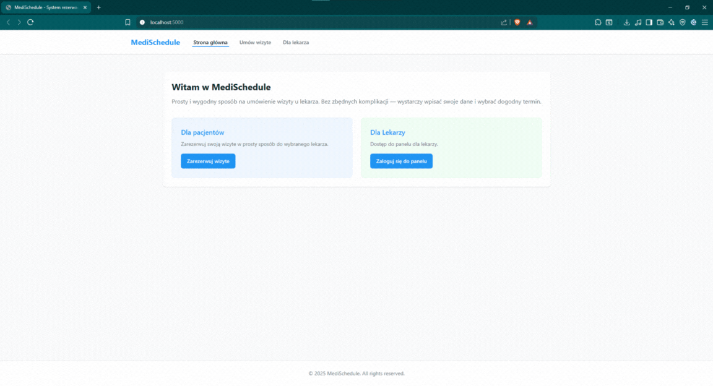

# MediSchedule
I do not permit any commercial use, editing, or using the code as your own for commercial purposes. Any use, either personal or commercial, without prior contact and explicit permission is strictly prohibited. Please contact me before using the code for any purpose to obtain consent.

## 🩺 MediSchedule – System Rezerwacji Wizyt Lekarskich 

❗ Zakaz wykorzystania komercyjnego bez zgody autora.
Projekt udostępniany jedynie do celów edukacyjnych i prezentacyjnych. Wszelkie formy użycia (osobiste lub komercyjne) wymagają wcześniejszego kontaktu i uzyskania wyraźnej zgody. 

## 📌 Opis projektu 

MediSchedule to aplikacja internetowa umożliwiająca zarządzanie wizytami lekarskimi. System pozwala pacjentom na łatwe rezerwowanie wizyt online, a lekarzom na sprawne zarządzanie harmonogramem. Projekt został zrealizowany w technologii React + TypeScript po stronie frontendu oraz Express + Node.js po stronie backendu. Podstawa aplikacji utworzona za pomocą Replit.com (Wspaniałe możliwości ma, nawet te darmowe) - wszelkie poprawki, funkcjonalność została przeze mnie utworzona.  

## ⚠️ Licencja i zasady użytkowania 

❌ Zabronione działania:

Komercyjne wykorzystanie kodu bez wyraźnej zgody autora. 
 
Edycja i publikacja kodu jako własnego w jakiejkolwiek formie komercyjnej.

Wykorzystanie bez uprzedniego kontaktu i pozwolenia. 

🔒 Aby uzyskać zgodę na użycie kodu, skontaktuj się z autorem przed jego wykorzystaniem. 

## 🛠 Instalacja i konfiguracja
Najłatwiej jest użyć Visual Studio Code  
Otwieramy lokalizacje plików projektu, otwieramy konsole i wpisujemy po kolei:  
npm install 
npm run dev 

🌐 Aplikacja będzie dostępna pod http://localhost:5000

##  Wymagania

Node.js (v18 lub wyższy)

## 📋 Funkcjonalności

## 👨‍⚕️ Interfejs Lekarza

✔️ Podgląd wszystkich zaplanowanych wizyt. 
✔️ Zarządzanie kalendarzem wizyt. 
✔️ Odrzucanie rezerwacji. 

## 🧑‍💻 Interfejs Pacjenta

✔️ Przegląd dostępnych terminów. 
✔️ Rezerwacja wizyt. 

## ⚙️ Technologie
Frontend: React + TypeScript, Tailwind CSS, react-hook-form, React Query, Wouter

Backend: Express, Node.js, Zod

Inne: Vite (bundler), REST API, walidacja po stronie klienta i serwera

## 📸 Zrzuty ekranu i demo 
🎥 Poniżej znajduje się gif z funkcjonalnościami systemu: 

👉  

## 👥 Odbiorcy systemu 
Pacjenci: osoby chcące rezerwować wizyty medyczne online. 

Lekarze: specjaliści zarządzający swoim kalendarzem i dostępnością. 

## 📩 Kontakt 

Jeśli masz pytania dotyczące projektu, skontaktuj się ze mną przed jego użyciem.   
